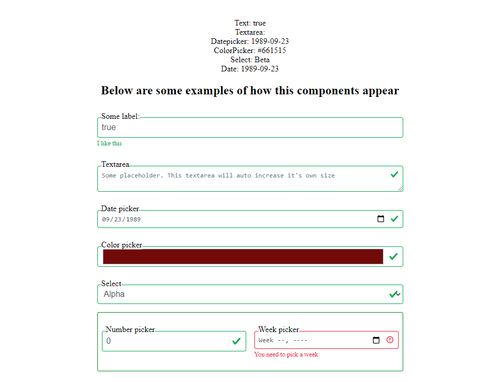

# @fabrigeas/react-form-group

This is a react single component that mimics most of the HTMLInputElements.

A Single component that can be used as:

- input of all the types i.e text,
- `DatePicker`,
  `ColorPicker`,
- `NumberPicker`,
- `textarea` with auto-resize. This means the size increases as the textarea fills up
- `checkbox`, radio button switch, name it yourself

## [Demo](https://codesandbox.io/s/github/fabrigeas/react-formg-group)

## Screenshots



## Usage

<!-- prettier-ignore -->
```html
npm install @fabrigeas/react-form-group

import FormGroup from "react-form-group"

<FormGroup
  value={value}
  onChange={onChange}
  label="Hello"
  invalid={value.length < 3}
  invalidFeedback={"This is wrong"}
  validFeedback={"I like this"}
  data={{
    name: "fabrigeas",
    age:30,
  }}
  events={{
    onKeyUp: console.error
  }}
  attrs = {{
    required: true,
    autoComplete: "off",
    name: "Name"
  }}

  classes="green red yellow blue"
/>
```

## Props

```JS
<FormGroup params:FormGroupProps />

export interface FormGroupProps {
  children?: React.ReactNode,
  attrs?: React.HTMLProps<Element>,
  data?: Object,
  events?: React.DOMAttributes<ReactNode>,
  onChange: ChangeEventHandler,
  label?: string,
  type?: string,
  style?: React.CSSProperties,
  classes?: string,
  value: any,
  invalid?: Boolean,
  invalidFeedback?: string,
  validFeedback?: string,
  [index: string]: any,
  aria?: React.AriaAttributes
}
```

### value: {any} [Required]

<!-- prettier-ignore -->
```html
<FormGroup
  value={value} <!-- the value of the input-->
  onChange={onChange} <!-- required-->
/>
```

### onChange: {ChangeEventHandler}[Required]

<!-- prettier-ignore -->
```html
<FormGroup
  value={value}
  onChange={onChange} <!-- onChange handler-->
/>
```

### type: {String}[optional]

<!-- prettier-ignore -->
```html
<FormGroup
  value={value}
  onChange={onChange}

  <!-- determines the type of the input -->
  <!-- eg. intpt | date | textarea | select | etc -->
  type="string"
/>
```

### label: {String}[optional]

<!-- prettier-ignore -->
```html
<FormGroup
  value={value}
  onChange={onChange}
  label="Some label"
/>
```

### children: {React.ReactNode} [Optional]

Only for select (i.e. the options)

<!-- prettier-ignore -->
```html
<FormGroup type="select" value={value} onChange={onChange}>
  <option>Alpha</option>
  <option>Beta</option>
  <option>Charly</option>
</FormGroup>
```

### attrs: {React.HTMLProps<Element>}[Optional]

contains your html attributes

<!-- prettier-ignore -->
```html
<FormGroup
  value={value}
  onChange={onChange}
  attrs = {{
    required: true,
    autoComplete: "off",
    name: "Name"
    placeholder= "some placeholder"
  }}
/>
```

### data: {Object}[Optional] contains your dataset properties

<!-- prettier-ignore -->
```html
<FormGroup
  value={value}
  onChange={onChange}
  data={{
      name: "fabrigeas",
      age:30,
    }}
/>
```

### events: {React.OMAttributes<ReactNode>}[Optional]

contains your React.Events

<!-- prettier-ignore -->
```html
<FormGroup
  value={value}
  onChange={onChange}
    events={{
      onKeyUp: console.log,
      onKeyDown: console.log,
    }}
/>
```

### style: {React.CSSProperties}[Optional]

contains the styles for the input

<!-- prettier-ignore -->
```html
<FormGroup
  value={value}
  onChange={onChange}
  label="Some label"
/>
```

### classes {String}[Optional]

a space separated string list of classes for the input

<!-- prettier-ignore -->
```html
<FormGroup
  value={value}
  onChange={onChange}
  classes="alpha beta"
/>
```

### invalid {Boolean} [optional] default is false

<!-- prettier-ignore -->
```html
<!-- Determines the color of the input border.
green for valid, red for invalid -->
    <FormGroup
      value={value}
      onChange={onChange}
      classes="alpha beta"
    />
```

### invalidFeedback {String} [optional]

<!-- prettier-ignore -->
```html
<!-- An error message to display below the input
Must be combined with invalid=true -->
<FormGroup 
  value={value} 
  onChange={onChange}
  invalidFeedback="Please fill this input"
/>
```

### validFeedback {String} [optional]

<!-- prettier-ignore -->
```html
<!-- A success message to display below the input
Must be combined with invalid=false -->

<FormGroup
  value={value}
  onChange={onChange}
  validFeedback="looks good"
/>
```

## wari {Object}[optional] (coming soon)

<!-- prettier-ignore -->
```html
Web accessibility attributes

```

## Todo

- Implement Wari attributes

- Add default patterns
